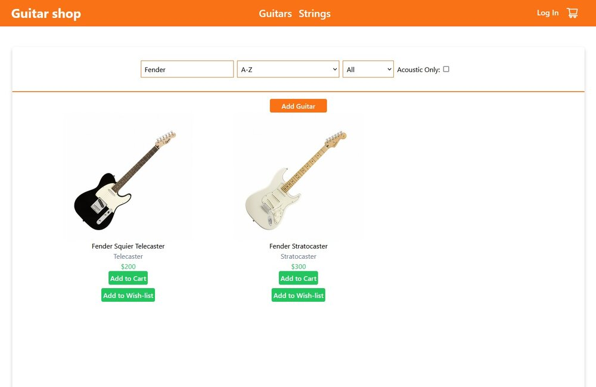
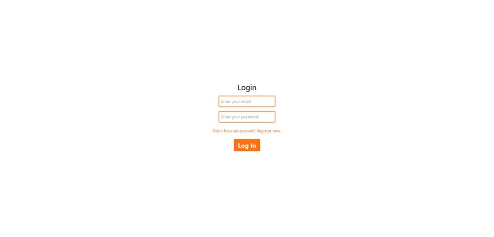
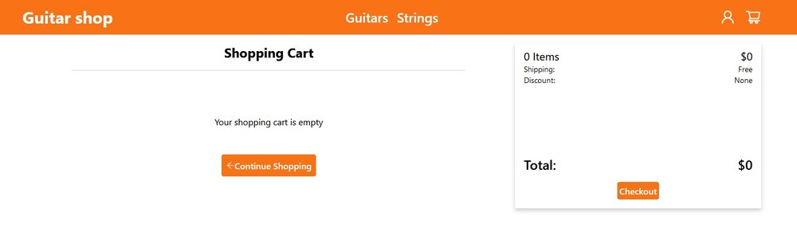
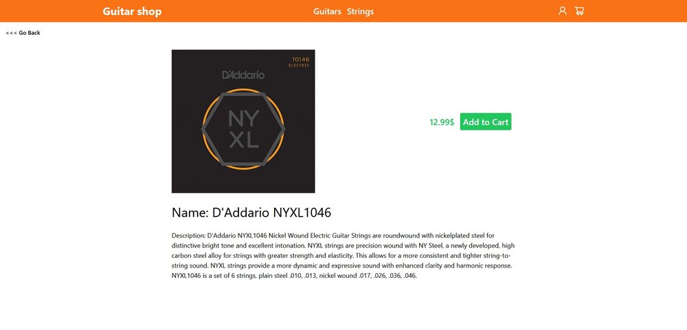

# Guitar shop :guitar:

This is a final project for Frontend Web Development course at my University.

It's a frontend side of Guitar Shop website that allows users to search through guitars or strings and lets them put the products in their shopping cart/wishlist. It also allows users to create accounts and log in.

## Technologies used :computer:

The app is made using:

-   React
-   TailwindCSS
-   Redux
-   Redux Toolkit
-   Formik.

It also connects to MongoDB using mongoose package.

Additional things I've done are a basic REST API, as well as Authorization and Authentication (the app doesn't use advanced authorization/authentication like JWT as it wasn't my goal to include that in this project and I've focused purely on the frontend).

## What have I learned? :mortar_board:

The most important things I've learned in the making of this project are:

-   Redux state management
-   Searching/sorting and filtering
-   Forms validation and error messages using Formik
-   Get to know how to use Redux state management asynchronously

## Final effect :heavy_check_mark:

